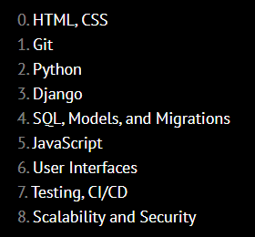
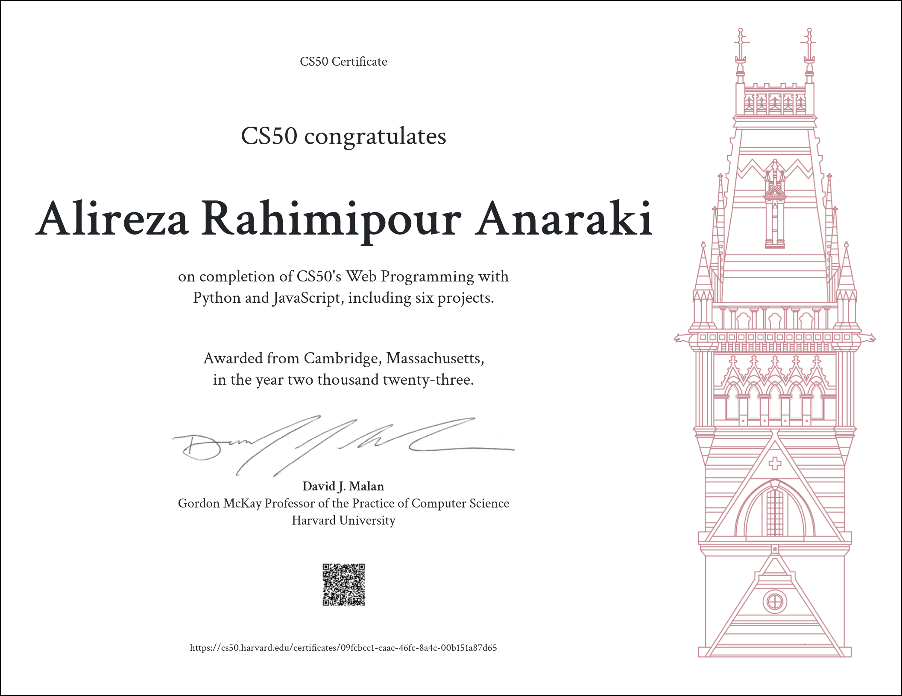

Harvard CS50W — 2022 Solutions 😎
=====================

-   [Course Link](https://cs50.harvard.edu/web/2020/)
-   [My Certificate](https://cs50.harvard.edu/certificates/09fcbcc1-caac-46fc-8a4c-00b151a87d65)
-   [Final Project](https://github.com/alirezarpa/Text-to-HTML-converter)

## What is it?

This course picks up where CS50x leaves off, diving more deeply into the design and implementation of web apps with Python, JavaScript, and SQL using frameworks like Django, React, and Bootstrap. Topics include database design, scalability, security, and user experience. Through hands-on projects, students learn to write and use APIs, create interactive UIs, and leverage cloud services like GitHub and Heroku. By semester’s end, students emerge with knowledge and experience in principles, languages, and tools that empower them to design and deploy applications on the Internet.

-   ✅ Videos
-   ✅ Project & Final Project
-   ✅ Slides & Notes

## Works

This repository is used to store my solutions to weekly assignments. You can click on the folder to see a detailed description of weekly assignments and my achievement.

> A quick word on [Academic Honesty](https://cs50.harvard.edu/x/2022/honesty/). While these solutions will help you to get through the course without too much effort, you should do your best to figure out a working solution yourself before taking a look at any of my solutions. Investing your time and energy into solving the problem sets yourself is in my opinion the only way to eventual mastery.
Go ahead and take a peek at the solutions.

## Table of Contents
- [Project 0: Search](/Project0/search)
- [Project 1: Wiki](/Project1/wiki)
- [Project 2: Commerce](/Project2/commerce)
- [Project 3: Mail](/Project3/mail)
- [Project 4: Network](/Project4/network)

- [Final Project: Capstone](https://github.com/alirezarpa/Text-to-HTML-converter)
  * [Final Project](https://github.com/alirezarpa/Text-to-HTML-converter)

I finished this course on August 23, 2023.
The picture below shows my certificate after completing all the assignments:

